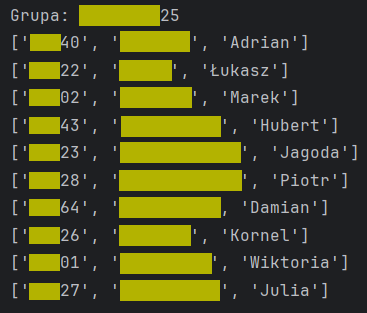

# Student Group Finder

Script that allows you to easily find other students that belong to a specified group in college.

### What does it do?
Code calls the student schedule API for every student from the input csv file. It then saves unique groups from the received data and saves them in the new csv file.

Another method in the script allows the user to search through this data and find other students that belong to the group passed in the function argument.

## How to use it?
1. Prepare a csv file with the student's unique number, first name, and last name that will look like the example one in the data directory.
2. Run the main function.
3. Set the searched group in the group variable.
4. Run another function that will print the students belonging to this group in the terminal.

## Example end result

